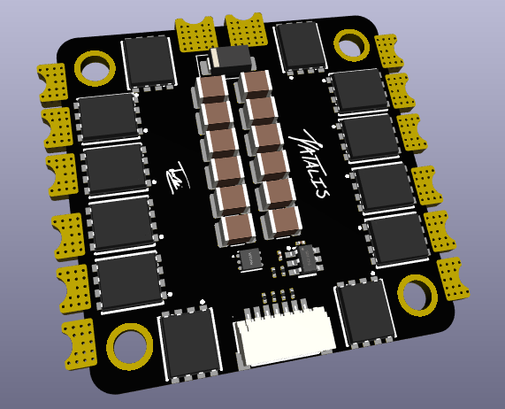
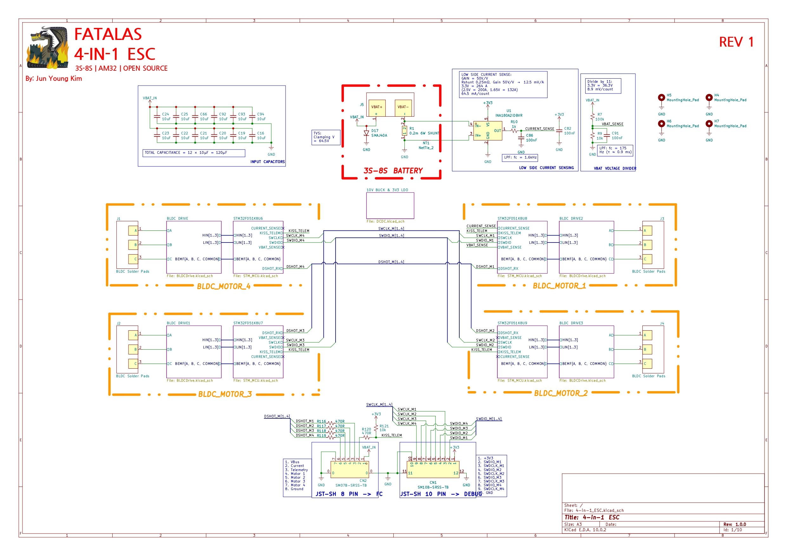
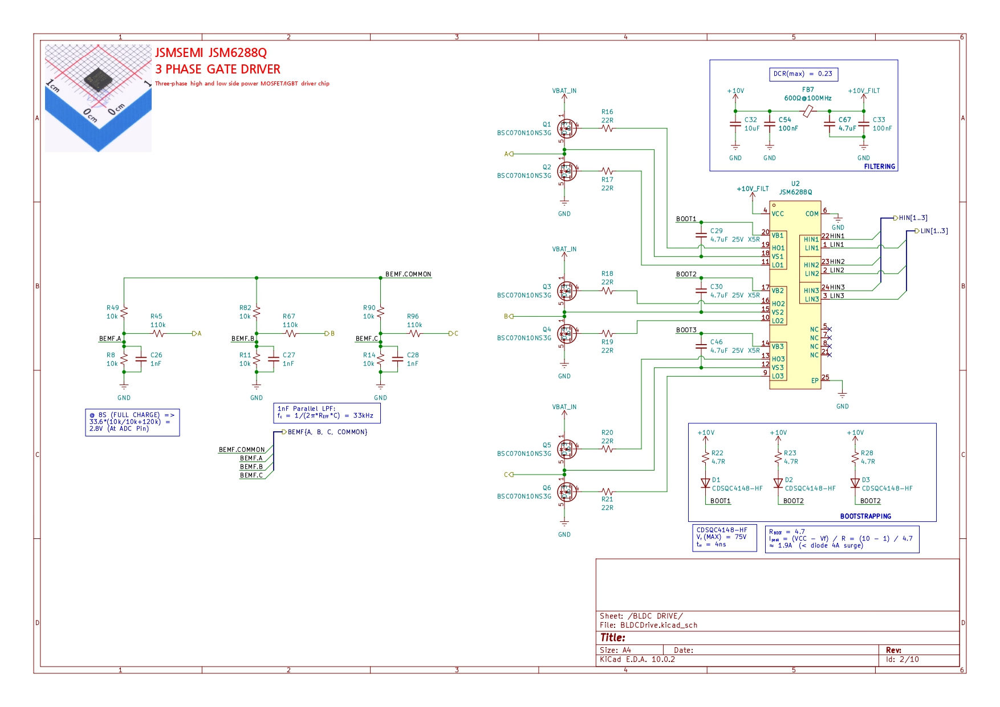
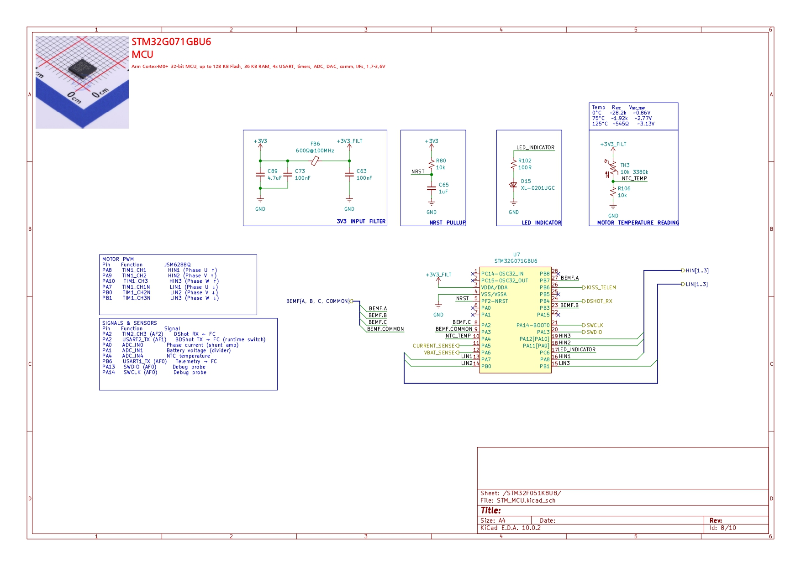
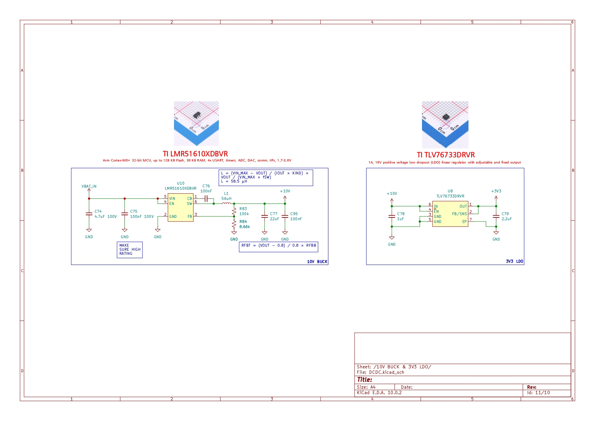

# FATALIS — 4-in-1 ESC

> **⚠ Work in Progress** — PCB layout and schematic are still under active development. Not yet sent for fabrication.

<em>3D render — in progress, not final</em>

<em>Top-level schematic</em>

A compact 4-in-1 brushless ESC designed for high-performance FPV racing and freestyle drones. Four independent motor drives on a single 40×40mm 6-layer PCB, each rated 45A continuous / 90A burst per motor, running AM32 open-source firmware on an STM32G071. Sponsored by PCBWay.

---

## Specifications

| Parameter | Value |
|-----------|-------|
| Input voltage | 3–8S LiPo (11–33.6V) |
| Continuous current | 45A per motor (phase current, with prop-wash airflow) |
| Burst current | 90A per motor (phase current, <10s) |
| Max input current | ~160A total board (4 motors at full throttle) |
| PCB size | 40mm × 40mm |
| PCB layers | 6 |
| MCU | STM32G071GBU6 × 4 (one per motor) |
| Firmware | AM32 (open-source) |
| MOSFETs | Infineon BSC070N10NS3G (100V, 7mΩ) |
| Gate driver | JSM6288Q half-bridge |
| Power regulator | TI LMR51610 buck (→10V) + TI TLV76733 LDO (→3.3V) |
| Protocols | DShot150/300/600, Oneshot125/42, Multishot, PWM |
| Telemetry | KISS / AM32 ESC telemetry (RPM, current, voltage, temperature) |
| Sensing | Per-motor current, battery voltage, temperature |

---

## Board Design

### Power Architecture

The input rail accepts 3–8S LiPo (up to 33.6V) and feeds directly into the MOSFET phase bridges. A TI **LMR51610** wide-VIN synchronous buck converter steps the battery voltage down to 10V at 400kHz, sized with a 56µH inductor and 22µF output filter for low ripple. A TI **TLV76733** LDO then regulates the 10V rail to a clean 3.3V supply for the MCUs and logic. Input bulk capacitors are 100V-rated ceramics with capacitance derating analysis applied (~50% effective capacitance at DC bias), ensuring adequate hold-up under the fast transients of motor switching.

### MOSFET Phase Bridges

Each of the four motor drives uses six **Infineon BSC070N10NS3G** N-channel MOSFETs (100V, 7mΩ) arranged in a standard 3-phase half-bridge topology. The 100V rating provides margin above the maximum 33.6V battery voltage, accounting for inductive flyback spikes during hard switching. Gate resistors and RC snubbers suppress ringing on the switch node without significantly degrading switching speed. The continuous current rating is thermally derived: at 45A phase current, conduction losses across the two active MOSFETs (I²×2×R_DS(on)_hot) stay within the thermal budget of the 6-layer copper pours under prop-wash cooling, keeping junction temperature below 125°C with a 50°C ambient.

### Gate Drive

**JSM6288Q** bootstrap half-bridge gate drivers provide high-current drive capability for fast MOSFET switching, with integrated bootstrap diodes charging the high-side gate supply on each PWM cycle. Bootstrap capacitors are sized to maintain sufficient gate drive voltage across the full duty-cycle range at maximum switching frequency.

### MCU & Firmware

Each motor channel has a dedicated **STM32G071GBU6** (Cortex-M0+, 64MHz) running **AM32** open-source ESC firmware. AM32's timer-based protocol auto-detection supports DShot150/300/600, Oneshot125/42, Multishot, and standard PWM without manual configuration. The STM32G071's advanced timers handle 3-phase complementary PWM generation with configurable dead-time insertion.

### Sensing & Telemetry

**Input current sensing** uses two **ASR-M-3-0.5F** (0.5mΩ, 6W, 2512) shunt resistors in parallel on the low side, giving an effective 0.25mΩ shunt rated 12W total. At maximum board input current (180A across all four motors at full throttle), each shunt carries 90A and dissipates 4.05W — within the 6W per-unit rating with comfortable margin. An **INA180A2IDBVR** current sense amplifier (gain = 50V/V) reads the differential voltage across the shunt; at 180A the output is 2.25V, well within the 3.3V ADC rail. Low-side placement keeps the common-mode voltage near 0V, so the INA180A2's 26V common-mode limit is not a concern across the full 3–8S input range.

**Per-motor current sensing** uses a dedicated low-side shunt on each phase leg, read by the STM32G071's internal ADC for real-time per-motor current feedback to AM32 firmware.

Battery voltage is monitored through a resistor divider, and an NTC thermistor on each motor channel provides board temperature. All sensor data is transmitted back to the flight controller over bidirectional DShot as KISS/AM32 telemetry frames, providing real-time RPM, current, voltage, and temperature at full loop rates.

### Thermal Design

Power dissipation analysis was performed on both the switching MOSFETs and the LMR51610 buck converter using junction-to-ambient and ψ_JB thermal metrics. At 45A continuous, conduction losses per motor (P = I²×2×R_DS(on)_hot ≈ 60W split across 6 MOSFETs) are managed by direct solder of exposed pads to the PCB and inner-layer copper pours acting as a thermal spreader. The 6-layer stackup provides additional thermal mass compared to a 4-layer design.

---

## Schematics

### Top-Level Overview
<table>
  <tr>
    <td></td>
    <td></td>
  </tr>
</table>

### BLDC Drive — Motor 1

### MCU — Motor 1 (STM32G071GBU6)

### BLDC Drive — Motor 2

### MCU — Motor 2 (STM32G071GBU6)

### BLDC Drive — Motor 3

### MCU — Motor 3 (STM32G071GBU6)

### BLDC Drive — Motor 4

### MCU — Motor 4 (STM32G071GBU6)

### Power Supply — 10V Buck & 3.3V LDO

---

## Repository Layout

| File / Folder | Contents |
|---------------|----------|
| `4-in-1_ESC.kicad_pro` | KiCad project file |
| `4-in-1_ESC.kicad_sch` | Top-level schematic |
| `BLDCDrive.kicad_sch` | BLDC motor drive sub-sheet |
| `DCDC.kicad_sch` | Power supply sub-sheet |
| `STM_MCU.kicad_sch` | STM32G071 MCU sub-sheet |
| `I_V_SENSE.kicad_sch` | Current / voltage sensing sub-sheet |
| `4-in-1_ESC.kicad_pcb` | PCB layout |
| `libs/` | Symbols, footprints, and 3D models |
| `images/schematics/` | Schematic export images |

---

*Sponsored by [PCBWay](https://www.pcbway.com)*
